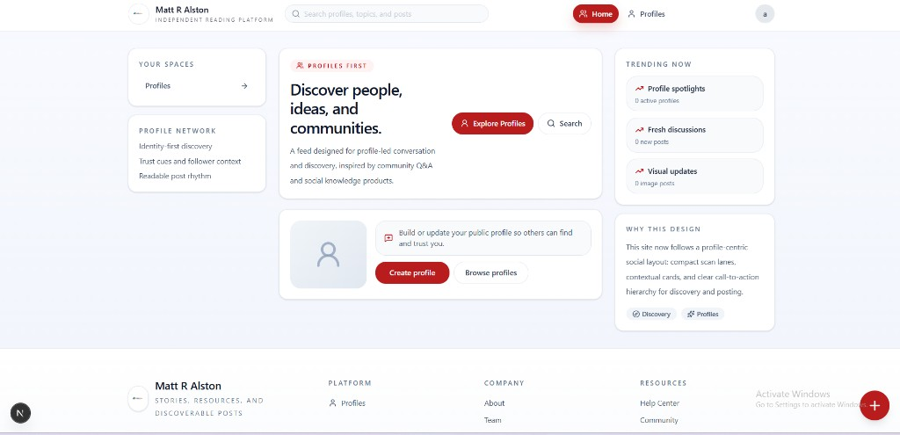
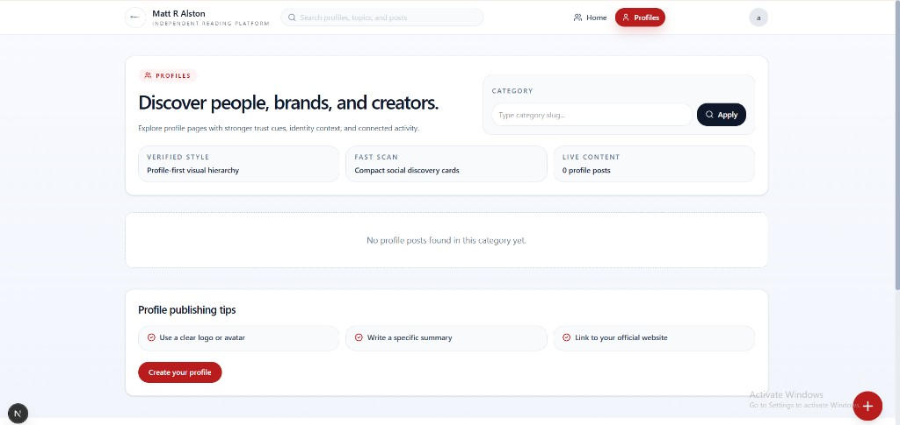
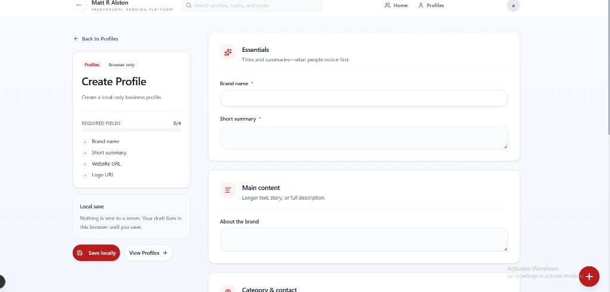
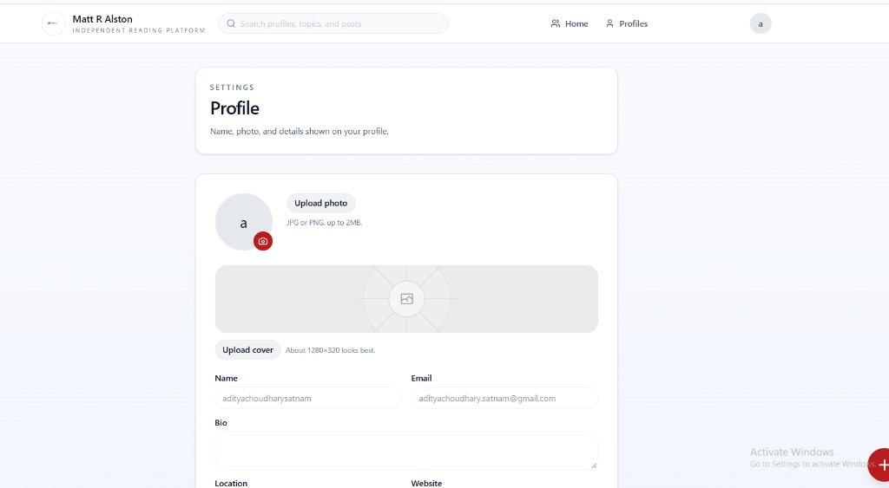
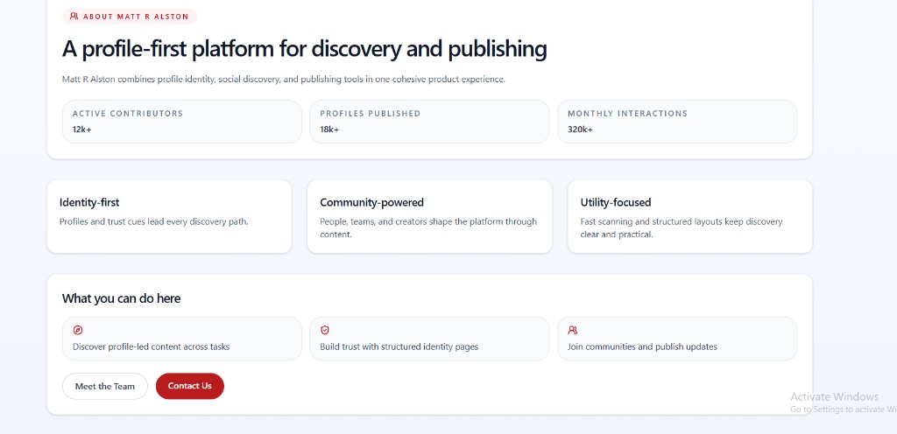
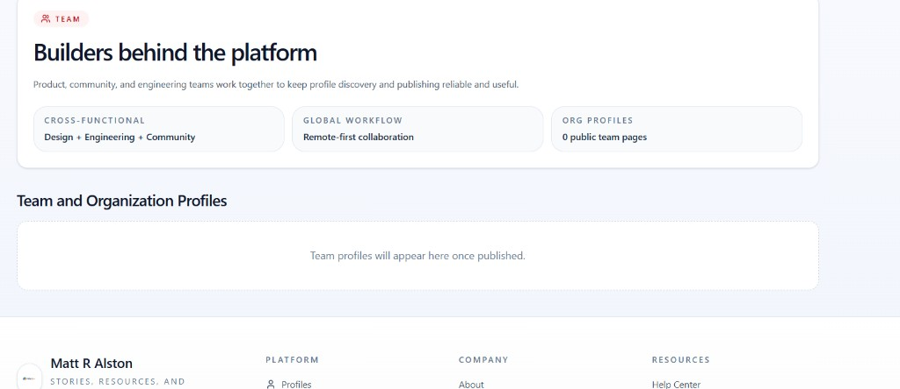
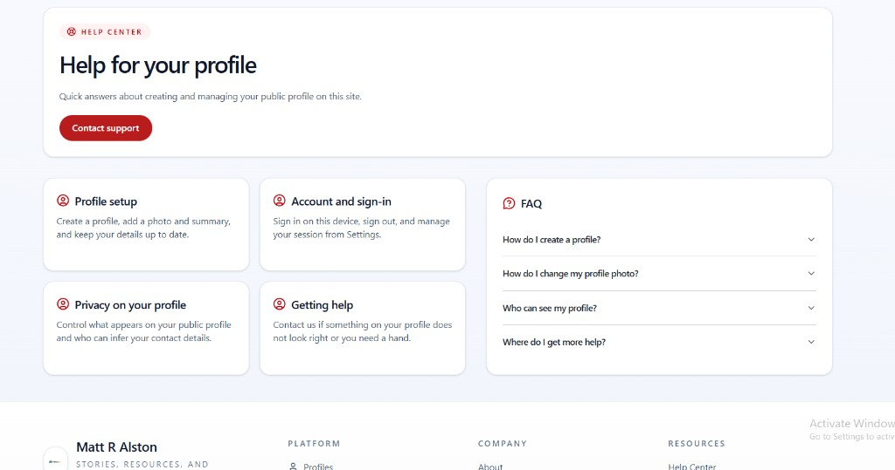

# Matt R Alston — Independent Reading Platform

Next.js site focused on profile-led discovery, local publishing flows, and a consistent light UI (red accent, rounded cards).

## Screenshots

Images are stored in [`docs/screenshots/`](./docs/screenshots/) and render below on GitHub when this file is viewed on the default branch.

### Home



### Profiles



### Create profile



### Settings (profile)



### About



### Team



### Help center



## Development

```bash
pnpm install
pnpm dev
```

Open [http://localhost:3000](http://localhost:3000).

## Adding or replacing screenshots

1. Save PNGs under `docs/screenshots/` using the names above (or add new files and update the image paths in this README).
2. Commit and push; GitHub will show them inline in this file.
